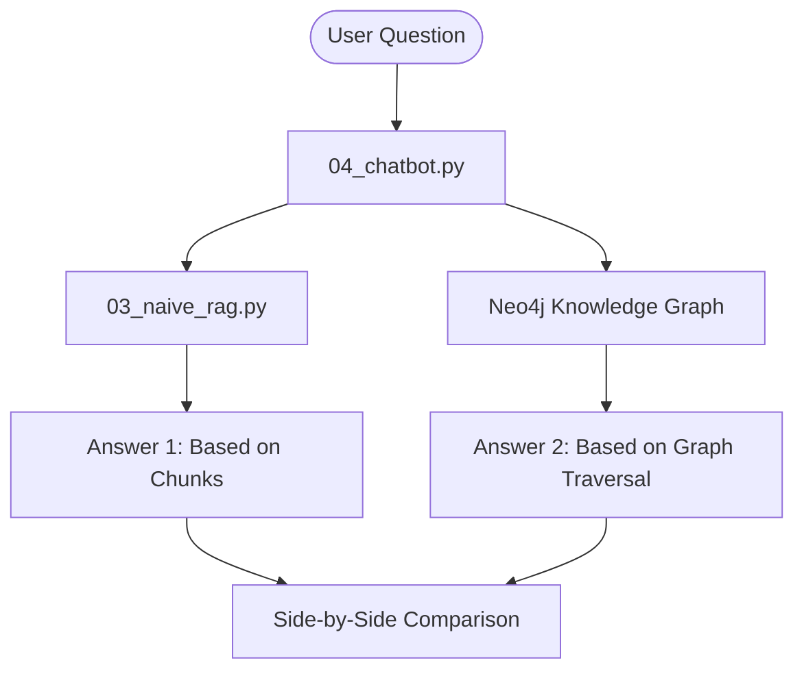

## 🏛️ Architecture

Our lab pits two retrieval strategies against each other using the same data:

1.  **Naive RAG (Vector)**: Chunks text from `sample_data.txt` and uses cosine similarity (semantic search).
2.  **Graph RAG (Ours)**: Uses Neo4j relationships to traverse deep connections (structural search).



---

## 📁 Project Structure

| File | Role | Description |
| :--- | :--- | :--- |
| `01_load_and_verify.py` | Ingestion | Loads the Movie dataset into Neo4j. |
| `02_analysis.py` | Analytics | Graph algorithms (Centrality, Pathfinding). |
| `03_naive_rag.py` | Baseline | Simple vector-based RAG using local embeddings. |
| `04_chatbot.py` | **The Finale** | Interactive Dual-RAG chatbot (Battle Mode). |
| `05_reset_database.py` | Maintenance | Wipes the database and restores clean baseline. |
| `config.py` | Configuration | Centralized settings for Neo4j and LLMs. |
| `sample_data.txt` | Source Data | Text source synchronized with the Knowledge Graph. |

---

## 🛠️ Getting Started

### 1. Requirements
- **Docker Desktop** (for Neo4j)
- **Ollama** (for local Llama 3.2 + all-minilm embeddings) or **OpenAI API Key**.

### 2. Setup Environment
Ensure your `.env` is configured (or use `config.py` defaults):
```bash
LLM_PROVIDER="ollama"
LLM_MODEL="llama3.2"  # Recommended for speed
EMBEDDING_MODEL="all-minilm" # Lightweight & local
```

### 3. Install Dependencies
```bash
pip install -r requirements.txt
```

---

## 🎓 The Educational Sequence

### Step 1: Initialize the Graph
```bash
docker compose up -d
python 01_load_and_verify.py
```
This loads our movies and creates an **Educational Bridge**:
- Keanu Reeves → *The Matrix* → Hugo Weaving → *The Green Mile* → Tom Hanks.

### Step 2: Graph Analysis (No AI needed!)
```bash
python 02_analysis.py
```
Discovery: Tom Hanks is the "Hub" of our dataset. We find everyone within 2 co-acting steps of Keanu.

### Step 3: Run Naive RAG
```bash
python 03_naive_rag.py
```
Observe how vector search handles simple questions, but struggles with multi-hop logic.

### Step 4: [THE BATTLE] Dual-RAG Chatbot
```bash
python 04_chatbot.py
```
**Try this question**: *"Who are the co-actors of the co-actors of Keanu Reeves?"*
- **Naive RAG**: Will fail to connect the separate movie chunks.
- **Graph RAG**: Will traverse the "Bridge" and correctly identify **Tom Hanks**.

### Step 5: Reset & Reproduce
```bash
python 05_reset_database.py
```
Wipe everything and start over from a clean state.

---

## 🧩 Key Cypher Patterns for Students

- **Single Hop**: `(p:Person)-[:ACTED_IN]->(m:Movie)`
- **Double Hop**: `(p1)-[:ACTED_IN]->()<-[:ACTED_IN]-(co1)-[:ACTED_IN]->()<-[:ACTED_IN]-(co2)`
- **Counting**: `MATCH (p:Person)-[:ACTED_IN]->(m) RETURN p.name, count(m) AS movies`

---
